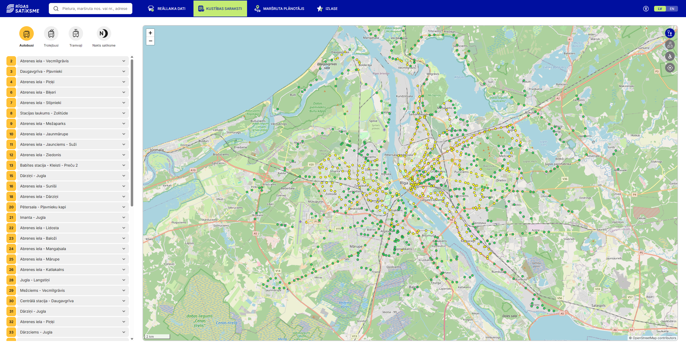
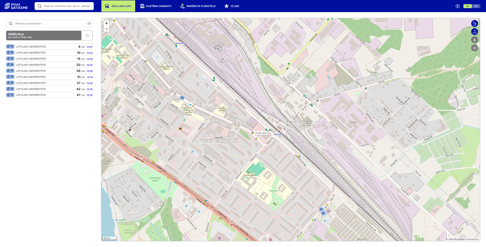
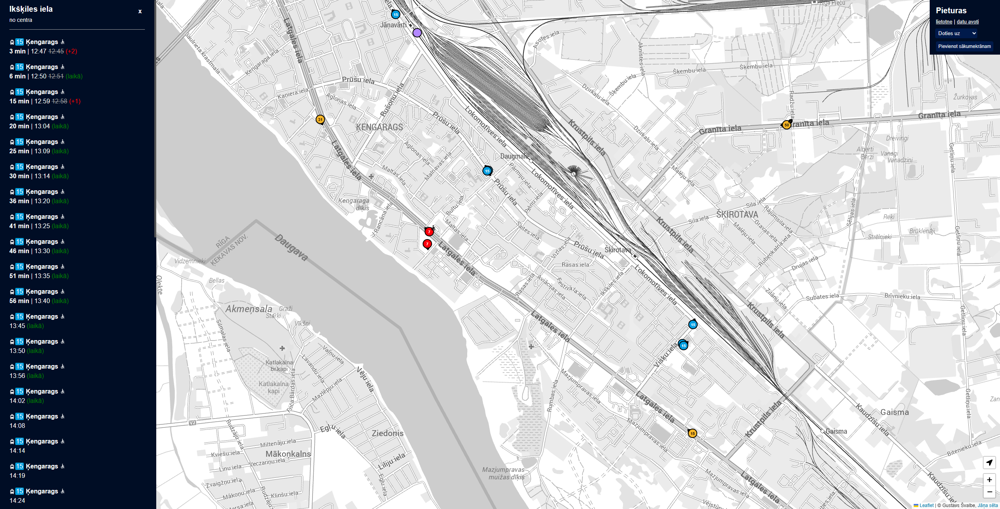

# Projekta analīze — Rīgas Sabiedriskā Transporta Reāllaika Tablo

## 1. Projekta nosaukums

**Rīgas Sabiedriskā Transporta Reāllaika Tablo**
*(Public Transport Real-Time Departure Board – Riga)*

## 2. Ko projekts dara (vienā teikumā)?

Projekts nodrošina reāllaika autobusu, trolejbusu, tramvaju atiešanas laiku pārskatu no konkrētiem pieturas punktiem Rīgā, attēlojot datus vizuālā web paneļa veidā ar automātisku atjaunināšanu.

## 3. Kādu problēmu šis projekts risina?

Sabiedriskā transporta lietotājiem bieži nav ērta veida, kā vienuviet redzēt vairāku tuvējo pieturu atiešanas laikus reāllaikā — īpaši ja nav viedtālruņa vai nepieciešams ātri novērtēt situāciju skolā. Esošās oficialās lietotnes (e.g., 1188.lv) ir domātas mobilajam telefonam un nenodrošina pārskatāmu "tablo" skatu vairākām pieturām vienlaicīgi. Šis rīks ir **informācijas/produktivitātes rīks**, kas palīdz plānot ceļu, redzot visu piestātņu departures uz viena ekrāna.

## 4. Mērķauditorija

Galvenie lietotāji:
- **Skolēni**, kuri katru dienu lieto sabiedrisko transportu un vēlas ātri redzēt nākamos autobusus no vairākām pieturām
- **Skolas darbinieki**, kuri katru dienu lieto sabiedrisko transportu un vēlas ātri redzēt nākamos autobusus no vairākām pieturām

## 5. Kā lietotājs mijiedarbosies ar programmu?
Lietotājs strādā ar **web pārlūkprogrammu (grafiska lietotāja saskarne — GUI)** :
1. `main.py` palaiž lokālu serveri uz 
2. `index.html` tiek atvērts pārlūkā
3. Lapa atjauninās automātiski ik pēc noteikta laika
4. Dati tiek parādīti krāsainās kartītēs — katra kartīte = viena pietura, katra rinda = nākamais transportlīdzeklis

Nav nepieciešama konsolē ievade vai Telegram bots — viss notiek vizuāli pārlūkā.

## 6. Galvenās funkcijas (must-have)

1. **Reāllaika atiešanas laiku ielāde** — Flask API izsauc `stops.lt` API un atgriež nākamos 10 transportus katrai pieturei
2. **Vairāku pieturu vienlaicīgs pārskats** — visas pieturas no `stops.json` redzamas vienā ekrānā kā kārtis
3. **Transports pēc veida ar krāsainiem žetoniem** — autobuss (dzeltens), trolejbuss (zils), tramvajs (sarkans)
4. **ETA krāsu kodēšana** — zaļš mirgojums = "Pienāk tagad", dzeltens = drīz, pelēks = aizbrauca
5. **Automātiska lapu atsvaidzināšana ar progresa joslu** — lietotājam nav manuāli jāatjauno lapa

## 7. Esošo risinājumu analīze

### 7.1 Līdzīgi risinājumi

#### 1. saraksti.lv (Rīgas Satiksme oficīālais portāls)
- **Apraksts:** Tīmekļa vietne ar autobusu sarakstiem un reāllaika atrašanās vietu kartē; mobilā lietotne
- **Ekrānšaviņš:** 
<picture>
    
    
</picture>

#### 2. Pieturas (starptautiska sabiedriskā transporta lietotne)
- **Apraksts:** Mobilā lietotne ar maršrutu plānošanu, realtime ETA, brīdinājumiem; pieejama arī Rīgā
- **Ekrānšaviņš:**
<picture>
    
</picture>

### 7.2 Plusi un mīnusi

| Parametrs | **saraksti.lv** | **Pieturas** | **Šis projekts** |
|---|---|---|---|
| Vairākas pieturas vienlaicīgi | ❌ Tikai viena pietura | ❌ Tikai viena pietura | ✅ Visas konfigurētās pieturas |
| Tablo/displeja režīms | ❌ Nav | ❌ Nav | ✅ Ir — domāts monitoram |
| Mobilā lietotne | ✅ Ir | ✅ Ir | ❌ Nav |
| Maršrutu plānošana | ✅ Pilna | ✅ Pilna | ❌ Nav |
| Pielāgojamība | ❌ | ❌ | ✅ stops.json |
| Interneta pieslēgums nepieciešams | ✅ | ✅ | ✅ |
---
#### saraksti.lv

**Plusi:**
- Oficiāli, uzticami dati tieši no Rīgas Satiksmes
- Mobilā un datora versija
- Rāda transporta atrašanās vietu kartē reāllaikā

**Mīnusi:**
- Var skatīt tikai **vienu pieturu vienlaicīgi**
- Nevar uzstādīt kā "tablo" monitorā

---

#### Pieturas

**Plusi:**
- Starptautisks, darbojas daudzās pilsētās
- Maršrutu plānošana ar pārsēšanos
- Paziņojumi par kavēšanos

**Mīnusi:**
- Galvenokārt mobilā lietotne
- Nav "multi-stop tablo" skata
- Mobilās aplikācijas lejupielādēšana nepieciešama pilnai funkcionalitātei

## 8. Secinājums

Šis projekts aizpilda nepilnību, ko nespēj aizpildīt esošie risinājumi — tas ļauj redzēt **vairāku pieturu atiešanas laikus vienā vizuālā tablo skatā**, kas ir ideāli piemērots uzstādīšanai uz monitora skolās vai birojā. Salīdzinot ar saraksti.lv un Pieturas, šis rīks ir vairāk specializēts konkrētam lietošanas scenārijam: ātrai situācijas novērtēšanai no fiksēta ekrāna.

